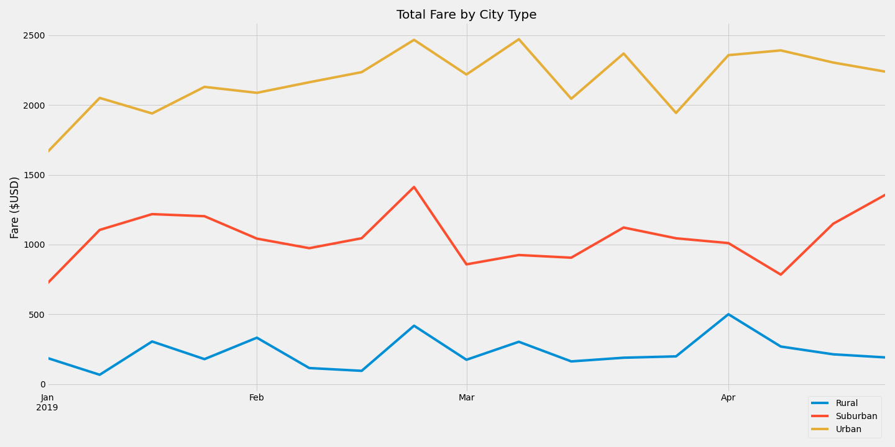

# PyBer Analysis
## Overview
This analysis is designed to compile and summarize ride-sharing data for PyBer, display it graphically, and then draw some conclusions about the data.

## Process
- Rides and City data files were uploaded and merged on the City variable together to form one unified DataFrame.
- Features for the summary DataFrame based on the three types of cities (Rural, Suburban, and Urban) were then calculated as follows:
  - Number of Rides
    ```
    pyber_citytype_group = pyber_data_df.groupby("type")
    pyber_rides_by_citytype = pyber_citytype_group["ride_id"].count()
    ```
  - Number of Drivers
    - This was calculated from the CityData, rather than the merged dataset.
    ```
    pyber_citydata_group = city_data_df.groupby("type")
    pyber_drivers_by_citytype = pyber_citydata_group["driver_count"].sum()
    ```
  - Sum of Fares
    ```
    # From earlier: pyber_citytype_group = pyber_data_df.groupby("type")
    pyber_fares_by_citytype = pyber_citytype_group["fare"].sum()
    ```
  - Average Fare per Ride
    ```
    avg_fare_per_ride_by_citytype = pyber_fares_by_citytype / pyber_rides_by_citytype
    ```
  - Average Fare per Driver
    ```
    avg_fare_per_driver_by_citytype = pyber_fares_by_citytype / pyber_drivers_by_citytype
    ```
- Summary DataFrame was created
- Data from 01/01 through 04/28 was isolated, resampled into weeks, and graphed.

## Results
### Figure 1: Summary DataFrame

### Figure 2: Line Plot of Total Fares, 01/01-04/28 data.


## Summary

### Summary DataFrame
- In every category, the data follows a linear correlation of 3 points, with Suburban values always falling in between the Rural and Urban values.
- However, not all categories follow a positive or negative correlation:
  - Total Rides and Drivers are both much higher in Urban areas than Rural, which makes sense from a supply/demand standpoint.  Likewise, total fares are also higher.
  - However, the Average Fare per Ride is much higher for Rural rides, implying that when someone takes a Rural ride, they are either traveling longer distances, paying higher rates, or something that causes the price to increase significantly.
    - **Recommendation: Provide ride distance data for a secondary analysis to further explore the differences between Rural and Urban rides.**
  - As well, the Average Fare per Driver is also much higher, mostly due to fewer drivers - a Rural driver, on average, makes more than *triple* what an Urban driver makes!  In an Urban area, there seems to be much more competition between drivers than in a Rural area.
    - **Recommendation: Monitor Urban driver sign-ups to prevent over-saturation of driver supply and subsequent dissatisfaction by drivers of total earnings.**

### Line Plot of Total Fares
- In general, fares will go up as people travel to destinations and use PyBer to get around their travel destination rather than renting a car.  Here are some possible examples:
  - There is a fare spike about three-fourths through February - this corresponds with many Winter Break vacations for grade and high schools, implying that demand goes up as people travel, even in Rural areas.
    - **Recommendation: Ensure an adequate supply of drivers in all areas during this time, perhaps increasing rates slightly or using other incentives to encourage driver participation.**
  - There are a couple of spikes in the Urban fares in March, noticable but less so in Suburban and Rural areas.  Datewise, they may correlate with college Spring Break vacations in March (especially for Urban destinations), but the drop in the 2nd week of March is curious and could be investigated.
    - **Recommendation: Investigate dates for March Spring Break vacations, and ascertain if 2nd week of March is an outlier or related to Spring Break dates.**
  - There is a strong spike in late April for Suburban fares, despite a very slight decline in other areas, possibly due to people from cities returning to their families for Easter or Passover holidays.
    - **Recommendation: Ensure an adequate supply of Suburban drivers during these holidays, using incentives.**
